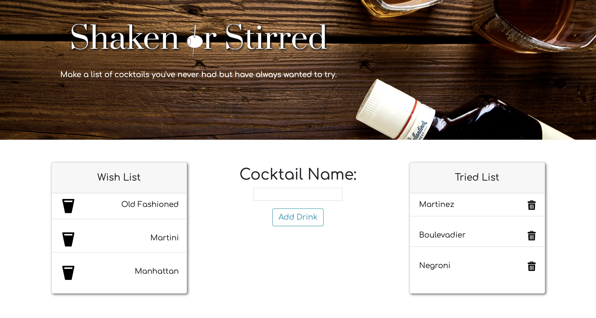
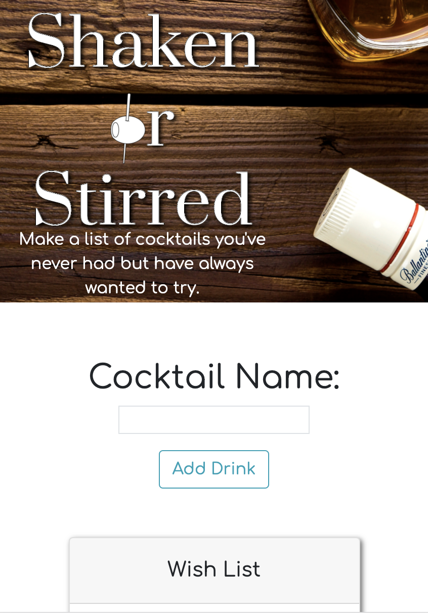

# 
Shaken or Stirred

## 🍸 About

This full-stack application allows a user to add cocktails to a "wish list" to keep track of any cocktail they have never had but have always wanted to try. It also lets them move those cocktails, after they try them, to a "tried list". The app is hosted on heroku and utilizes JawsDB to keep a SQL database of the cocktail names and values to indicate if they have been tried yet or not. 

***
## Preview

### Desktop 

<kbd></kdb>

### Mobile

<kbd></kbd>

***
## Table of Contents
1. [Languages & Technologies](#languages-&-technologies)
2. [Usage](#usage)
3. [License](#license)
4. [Contributing](#contributing)
5. [Contact Me](#contact-me)

***
## Languages & Technologies

* JavaScript
* HTML
* CSS
* JQuery
* Bootstrap
* Node
* Express
* Heroku
* MySQL

***
## Usage

Type into the input field a new cocktail that you want to try, then click "add drink".

Once the new drink is on the wish list, you can click the empty glass icon to move it to the tried list after you've drank it. 

You can also delete the drink from the tried list in case you made a mistake or want to keep your list tidy.

***
## License

***
## Contributing

jeffreymcfarland

***
## Contact Me    

<kbd></kbd> 
* Email: <jlmcfarlandj@gmail.com>
